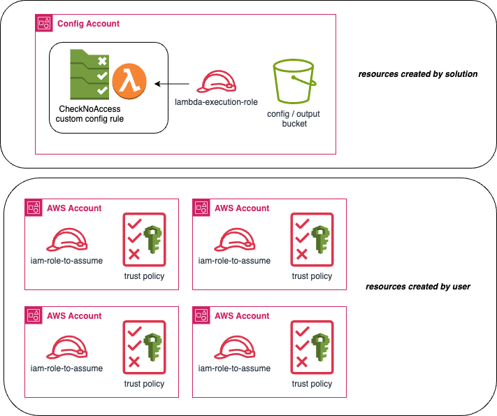

**DISCLAIMER: CURRENTLY PERFORMING INTEGRATION TESTING.  WILL BE READY FOR RELEASE 12/8/2023**

<div align="center">
 
</div>

# Policy General

Policy General is a solution designed to enforce compliance of IAM (Identity and Access Management) policies. It is responsible for checking whether IAM policies adhere to predefined sets of restricted actions, as specified in a configuration file.

## Table of Contents
- [Overview](#overview)
  - [Project Structure](#project-structure)
  - [Package Descriptions](#package-descriptions)
- [Prerequisites](#prerequisites)
  - [Resources Required by User](#resources-required-by-user)
    - [S3 Bucket](#s3-bucket)
    - [IAM Role(s)](#iam-roles)
    - [Trust Policy](#trust-policy)
- [Resources Created](#resources-created-by-solution)
  - [Custom AWS Config Rule](#custom-config-rule)
  - [Lambda Function](#lambda-function)
  - [Lambda Exeuction Role](#lambda-execution-role)
- [How it works](#how-it-works)
  - [Configuration](#configuration)
  - [Initialization](#initialization)
  - [Execution](#execution)
- [How to deploy](#how-to-deploy-step-by-step)
- [License](#license)

## Overview

This solution enhances security and compliance by enforcing IAM policy restrictions across multiple AWS accounts. The integration with AWS Config enables continuous detection through scheduled rule runs, providing flexibility for customized checks on a periodic schedule. 

<div align="center">
 
</div> 
  
### Project Structure 
```bash 
|-- deployment/           # deployment files
  |-- sam-lambda/         # sam template for deploying lambda func  
|-- handle/                    # event handler      
|-- internal/                   # internal pkgs 
  |-- awsclientmgr/             # aws client manager
  |-- entrymgr/                 # entry manager    
  |-- exporter/                 # exporter
  |-- iampolicyevaluator/       # iam policy evaluator
  |-- shared/                   # shared 
```
#### Package Descriptions

- `handle` - handles config event (entry point for processing)
- `awslcientmgr` - stores sdk clients used (iam, s3, access analyzer) 
- `entrymgr` - manages execution log entries 
- `exporter` - writes execution log entries to csv & publishes to S3 bucket
- `iampolicyevaluator` - main interface.  Process compliance checks
- `shared` - shared constants & types

## Prerequisites

Before deploying this solution, ensure your local development environment is equipped with the following:

- **Go Programming Language (v1.20+)**:
Download and install Go from the [official website](https://go.dev/dl/).

- **AWS SAM CLI**:
Install AWS SAM CLI by following the [AWS SAM CLI Installation Guide](https://docs.aws.amazon.com/serverless-application-model/latest/developerguide/install-sam-cli.html).

### Resources required by user

#### S3 Bucket
- **Purpose** - where config file & execution log results will be stored
- **BucketName** - user provided
- **Region**  - user provided

#### IAM Role(s)

1. For each accountId specified in the `config.json` file, you will need to create an IAM role that the lambda function can assume. Each role will require the following minimum permissions: 

```json 
{
  "Version": "2012-10-17",
  "Statement": [
    {
      "Sid": "IAM & Access Analyzer Actions",
      "Effect": "Allow",
      "Action": [
        "iam:ListUsers",
        "iam:ListUserPolicies",
        "iam:GetRolePolicy",
        "iam:ListRoles",
        "iam:ListRolePolicies",
        "iam:GetUserPolicy",
        "access-analyzer:CheckAccessNotGranted"
      ],
      "Resource": "*"
    }
  ]
}
```
#### Trust Policy 

To allow the lambda function execution role to assume this role via `sts:AssumeRole` create a trust policy on each role.

For example, your `config.json` file might look like this:

```json 
{
  "awsAccounts": [
    {
      "accountId": "123456789101",
      "roleName": "arn:aws:iam::123456789101:role/your-role-name"
    },
    {
      "accountId": "098765432109",
      "roleName": "arn:aws:iam::098765432109:role/your-role-name"
    }
  ],
  "actions": [
    "s3:GetObject",
    "s3:PutObject",
    "ec2:DescribeInstances",
    "lambda:InvokeFunction"
  ],
  "scope": "all" // valid values = roles, user or all
}
```

In this example, you would need to ensure that the IAM role's:
- `arn:aws:iam::123456789101:role/your-role-name`
- `arn:aws:iam::098765432109:role/your-role-name`

both have a trust policy allowing the lambda function's execution role to assume it.  Below is a sample trust policy : 

```json 
{
  "Version": "2012-10-17",
  "Statement": [
    {
      "Sid" : "Trust between AWS Config Rule Lambda Execution Role",
      "Effect": "Allow",
      "Principal": {
        "AWS": "arn:aws:iam::*CONFIG_ACCOUNT_ID*:role/policy-general-lambda"
      },
      "Action": "sts:AssumeRole"
    }
  ]
}
```
### Resources Created by Solution

Deploying the Policy General solution creates the following components: 

1. [Custom AWS config rule](#custom-config-rule)
2. [Lambda function](#lambda-function)
3. [Execution role for lambda function](#lambda-execution-role)
4. [S3 Bucket](#s3-bucket)

Please read each section below for more information about each created resource. 

#### Custom Config Rule 

- **Purpose** : check IAM identity policy compliance on an ongoing basis. 
- **Name** : checkNoAccess
- **Type** : Periodic 
- **Maximum Execution Frequency** : 24 hours (default) 
- **Lambda Function** : see section [Lambda Function](#lambda-function)

#### Lambda Function 

- **Purpose** - runs when config rule is invoked
- **Function Name** - checkNoAccess-aws-config
- **Memory Confiuration** - 256MB
- **Execution Role** - see section [Lambda Execution Role](#lambda-execution-role)

#### Lambda Execution Role

Below are the permissions used for the lambda function execution role: 

```json 
{
    "Statement": [
        {
            "Action": [
                "logs:CreateLogGroup",
                "logs:CreateLogStream",
                "logs:PutLogEvents"
            ],
            "Resource": "*",
            "Effect": "Allow",
            "Sid": "CloudWatchLogs"
        },
        {
            "Action": [
                "xray:PutTelemetryRecords",
                "xray:PutTraceSegments"
            ],
            "Resource": "*",
            "Effect": "Allow",
            "Sid": "XRay"
        },
        {
            "Action": [
                "s3:GetObject",
                "s3:PutObject"
            ],
            "Resource": "*",
            "Effect": "Allow",
            "Sid": "S3BucketAccess"
        },
        {
            "Action": [
                "iam:ListUsers",
                "iam:ListUserPolicies",
                "iam:GetRolePolicy",
                "iam:ListRoles",
                "iam:ListRolePolicies",
                "iam:GetUserPolicy"
            ],
            "Resource": "*",
            "Effect": "Allow",
            "Sid": "IAMActions"
        },
        {
            "Action": [
                "config:PutEvaluations",
                "access-analyzer:CheckAccessNotGranted"
            ],
            "Resource": "*",
            "Effect": "Allow",
            "Sid": "ConfigAndAccessAnalyzer"
        },
        {
            "Action": [
                "sts:GetCallerIdentity"
            ],
            "Resource": "*",
            "Effect": "Allow",
            "Sid": "GetCallerIdentity"
        }
    ]
}
```

## How it works

To understand how Policy General works behind the scenes, I will explain the config file it relies on and what occurs in the Initialization and Execution phase. 

### Configuration
Policy General is configured using a JSON file stored in S3. This configuration file specifies AWS account IDs, IAM service roles, a list of restricted actions, and a scope attribute.

```json 
{
  "awsAccounts": [
    {
      "accountId": "your_account_id_1",
      "roleName": "YourServiceRoleName1"
    },
    {
      "accountId": "your_account_id_2",
      "roleName": "YourServiceRoleName2"
    }
  ],
  "actions": [
    "s3:GetObject",
    "s3:PutObject",
    "ec2:DescribeInstances",
    "lambda:InvokeFunction"
  ],
  "scope": "all" // valid values = roles, user or all
}
```

- **awsAccounts**: An array of objects containing AWS account IDs and IAM role names that the Lambda function can assume.

- **actions**: An array of strings specifying the allowed or restricted actions that will be checked against IAM policies.

- **scope**: A string indicating the scope of IAM policies to be evaluated. It can take one of the two values: "roles," "users," or "all."

### Initialization 

1. Reads `CONFIG_FILE_BUCKET_NAME` and `CONFIG_FILE_KEY` from environment variable, loads config file from s3 and serializes file into **evaltypes.Config** struct 
```go
// Config represents the overall configuration structure.
type Config struct {
	AWSAccounts       []AWSAccount `json:"awsAccounts"`
	RestrictedActions []string     `json:"restrictedActions"`
	Scope             string       `json:"scope"`
}

 // AWSAccount represents an AWS account with its associated IAM role.
type AWSAccount struct {
	AccountID string `json:"accountId"`
	RoleName  string `json:"roleName"`
}
```
2. Validate the scope attribute is either "roles", "users" or "all". 
3. Validate the restricted actions match regex pattern 	
```go
// <service-namespace>:<action-name>
```
4. Create assume role provider and create iam & access analyzer SDK clients with the assumed roles from the config file.  Add the SDK clients to the client map with the accountID as the key.

### Execution 

1. For each AWS account Id, it will spawn a go routine and process the compliance of the IAM policies concurrently.
2. Results will be sent on a buffered channel and published to AWS Config

## How to Deploy (step by step)

- [Readme for Policy General deployment](./deployment/sam-lambda/README.md)

## License 

The project is license under the [Apache 2.0 License](./LICENSE)


## Contributions
Open for contributions, just open a pull request!